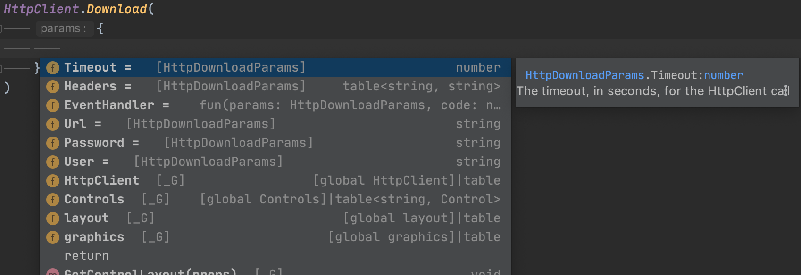

# Q-SYS Api Types

A set of [EmmyLua](https://emmylua.github.io/) type definitions for the Q-SYS type Lua API.

Provides type hints in supported editors.



## Prerequisites

The EmmyLua plugin for [Intellij Editors](https://emmylua.github.io/), or [VSCode](https://github.com/EmmyLua/VSCode-EmmyLua).

## Usage

Download the type definitions [releases](https://github.com/qsys-tools/qsys-api-types/releases) section on GitHub, and just place the lua file anywhere in the root directory of your project. 

Alternatively, install a command line to generate it anywhere via npm:

```
npm install -g qsys-api-types
```

Then you can output the latest definition using the provided CLI:

```
qsys-api-types > qsys.lua

# or

qsys-api-types -o qsys.lua

# or

qsys-api-types -o
```

The advantage of using command line is that you can incorporate it in a build script, and easily upgrade to new type definitions as they become available.
